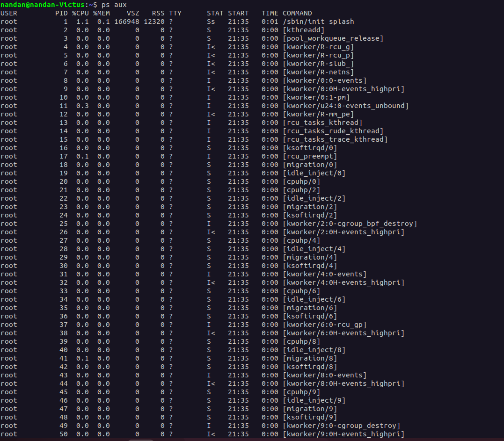
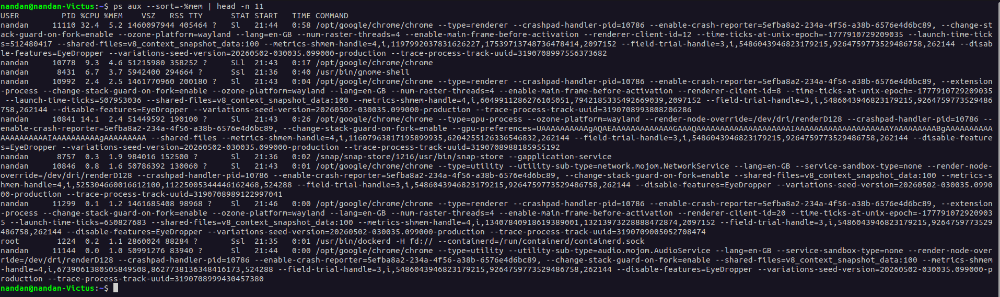
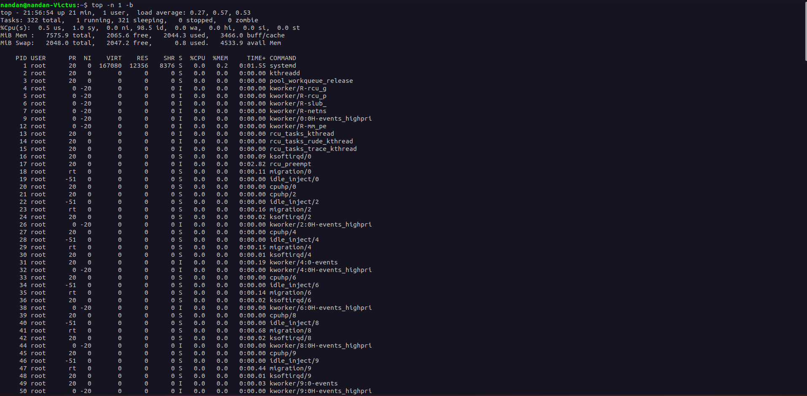
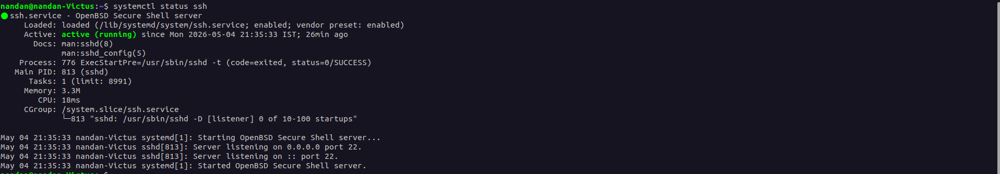
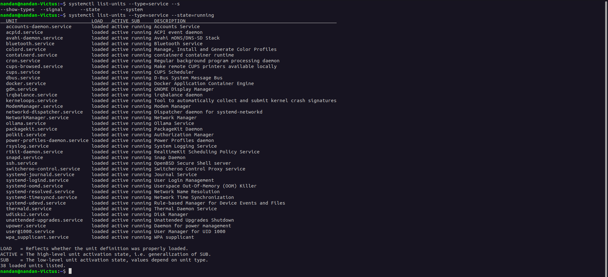
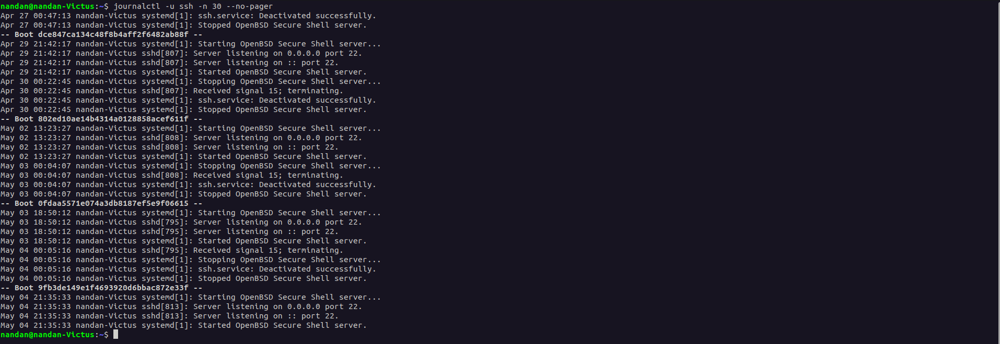
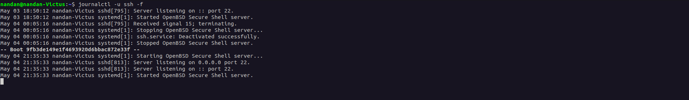
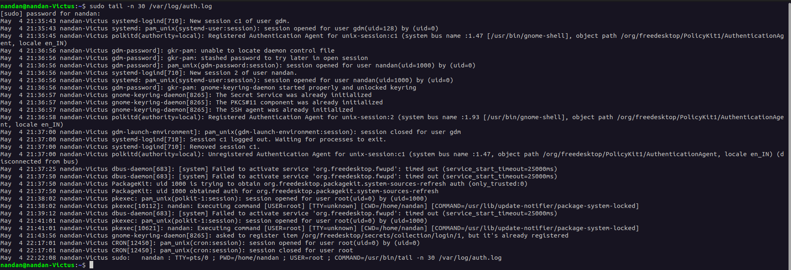

# 📚 Day 04 - Linux Practice: Processes and Services

**System:** Ubuntu 22.04 LTS  
**Service Inspected:** SSH (`sshd`)

---

## 1️⃣ Process Commands

### Command 1: List All Running Processes

```bash
ps aux
```

**What it does:**  
`ps` = Process Status. `a` = all users, `u` = user-oriented format, `x` = include background processes.

**Example Output:**
```
USER         PID %CPU %MEM    VSZ   RSS TTY      STAT START   TIME COMMAND
root           1  0.0  0.2 168684 11856 ?        Ss   08:15   0:03 /sbin/init
root         768  0.0  0.5  13672 10240 ?        Ss   08:15   0:00 sshd: /usr/sbin/sshd -D
```

**What I Observed in real hands-on:**
- PID 1 is always `systemd` - the parent of all processes
- `STAT` column: `S` = sleeping, `s` = session leader, `l` = multi-threaded

> 📸 Screenshot: `images/ps-aux.png`
> 

---

### Command 2: Top 10 Processes by Memory

```bash
ps aux --sort=-%mem | head -n 11
```

**What it does:**  
Sorts all processes by memory usage (highest first) and shows only the top 10.

**Example Output:**
```
USER         PID %CPU %MEM    COMMAND
nandan      2156  2.3  8.5   firefox
nandan      1856  1.2  3.8   gnome-shell
mysql        989  0.2  1.8   mysqld
```

**What I Observed in real hands-on:**
- Chrome dominates memory - spawns multiple processes (renderer, gpu-process,
  utility) per tab/extension - this is expected browser behavior
- gnome-shell (desktop) uses ~3.7% - normal for a GUI system 
- dockerd is running in background (~1.1%) even without active containers
- Key insight: heavy apps (browser, k8s) show up clearly; 
  lightweight services stay invisible in top 10 - that's a good sign
- System daemons like `sshd`, `cron` are lightweight (< 1%)

> 📸 Screenshot: `images/ps-mem.png`
> 

---

### Command 3: Find a Process by Name

```bash
pgrep -a sshd
```

**What it does:**  
`pgrep` searches for processes by name. `-a` shows the full command line.

**Example Output:**
```
768 /usr/sbin/sshd -D
3456 sshd: nandan [priv]
3489 sshd: nandan@pts/0
```

**What I Observed in above example output:**
- PID 768 = main SSH daemon (listener)
- Multiple PIDs per session = SSH creates child processes per login
- `pts/0` = pseudo-terminal (your active session)

**What I Observed in real hands-on:**
- PID 813 - SSH daemon is running
- [listener] — it's waiting/listening for incoming connections
- 0 of 10-100 startups — 0 active SSH sessions right now (nobody is connected via SSH)
- Only 1 sshd process (PID 813) - no active SSH sessions
- Running as listener, waiting for connections
- Confirms SSH is healthy and lightweight


> 📸 Screenshot: `images/pgrep-sshd.png`
> 

---

### Command 4: Real-Time Process Monitor

```bash
top -n 1 -b
```

**What it does:**  
`-n 1` = run once, `-b` = batch mode (non-interactive, good for logging).

**Example Output:**
```
top - 14:23:15 up 6:08,  2 users,  load average: 0.52, 0.58, 0.64
Tasks: 287 total,   1 running, 286 sleeping
%Cpu(s):  2.3 us,  0.8 sy,  96.5 id
MiB Mem :   3912.5 total,   245.8 free,  2456.2 used
```

**What I Observed in above example output:**
- Load average `0.52` = system is healthy (< number of CPU cores = not overloaded)
- `96.5% idle` = mostly idle system
- `top` refreshes every 3 seconds by default; press `q` to quit interactive mode

**What I Observed in real hands-on:**
- System running 21 mins, load average 0.27 - healthy and idle
- 322 tasks total, only 1 actively running - rest are sleeping
- CPU 98.5% idle, RAM only 27% used
- Top processes are kernel threads (kworker, migration) - Linux internal housekeeping, consume near-zero resources
- 0 zombie processes - clean system state


> 📸 Screenshot: `images/top.png`
> 

---

## 2️⃣ Service Commands

### Command 5: Check SSH Service Status

```bash
systemctl status ssh
```

**What it does:**  
Shows the current state, uptime, PID, memory use, and recent logs of a service.

**Example Output:**
```
● ssh.service - OpenBSD Secure Shell server
     Loaded: loaded (/lib/systemd/system/ssh.service; enabled)
     Active: active (running) since Tue 2026-02-03 08:15:22 IST; 6h ago
    Main PID: 768 (sshd)
     Memory: 3.2M

Feb 03 10:23:45 sshd[3456]: Accepted publickey for nandan from 192.168.1.105
```

**What I Observed in above example output:**
- `enabled` = service starts automatically at boot
- `active (running)` = currently healthy
- Recent log shows public key auth accepted (secure login method)

**What I Observed in real hands-on:**
- Service: active (running) ✅
- Running since: Mon 2026-05-04 21:35:33 - 26 mins ago
- Main PID: 813 (matches what pgrep showed earlier ✅)
- Memory: only 3.3M - extremely lightweight
- CPU: 18ms total - barely touched the CPU
- enabled - will auto-start on reboot
- Listening on 0.0.0.0 port 22 and :: port 22
  (0.0.0.0 = all IPv4, :: = all IPv6 interfaces)
- ExecStartPre ran sshd -t (config check) and passed - status=0/SUCCESS
- 0 of 10-100 startups - no active SSH sessions right now


> 📸 Screenshot: `images/systemctl-status-ssh.png`
> 

---

### Command 6: List All Running Services

```bash
systemctl list-units --type=service --state=running
```

**What it does:**  
Filters and lists only services that are currently in `running` state.

**Example Output:**
```
UNIT                          LOAD   ACTIVE SUB     DESCRIPTION
cron.service                  loaded active running Regular background program
docker.service                loaded active running Docker Application Container Engine
nginx.service                 loaded active running A high performance web server
ssh.service                   loaded active running OpenBSD Secure Shell server
systemd-journald.service      loaded active running Journal Service
```

**What I Observed in above example output:**
- All essential services are `loaded active running` = healthy
- `systemd-*` services are core Linux plumbing (logging, login, networking)

**What I Observed in real hands-on:**
- 38 services running in total
- All show: loaded active running - system is healthy ✅
- ssh.service is running ✅
- docker.service + containerd.service - Docker is still active in background
- ollama.service - you have Ollama (local AI) running on this machine
- cron.service - task scheduler running
- gdm.service - GNOME Display Manager (your login screen manager)
- systemd-oomd - Out-Of-Memory killer is active (safety net if RAM fills up)
- NetworkManager - managing your WiFi/network
- rsyslog - system logging is active
- wpa_supplicant - handles WiFi authentication


> 📸 Screenshot: `images/systemctl-list.png`
> 

---

### Command 7: Check if Service is Enabled at Boot

```bash
systemctl is-enabled ssh
systemctl is-active ssh
```

**Example Output:**
```
enabled
active
```

**What I Observed in above example output and hands-on:**
- `enabled` = will auto-start on reboot (important for production servers)
- `is-active` is useful in scripts to check service state programmatically

> 📸 Screenshot: `images/systemctl-is-enabled.png`
> 

---

## 3️⃣ Log Commands

### Command 8: View SSH Service Logs

```bash
journalctl -u ssh -n 30 --no-pager
```

**What it does:**  
`-u ssh` = filter by unit, `-n 30` = last 30 lines, `--no-pager` = print directly to terminal.

**Example Output:**
```
Feb 03 08:15:22 sshd[768]: Server listening on 0.0.0.0 port 22.
Feb 03 10:23:45 sshd[3456]: Accepted publickey for nandan from 192.168.1.105
Feb 03 12:15:33 sshd[4123]: Failed password for invalid user admin from 103.45.67.89
Feb 03 12:15:38 sshd[4156]: Failed password for invalid user root from 103.45.67.89
```

**What I Observed in above example output:**
- ✅ Legit login: `nandan` from local IP `192.168.1.105`
- ⚠️ Brute-force attempt: multiple failed logins from `103.45.67.89` trying `admin`, `root`
- Action: Consider setting up `fail2ban` to block repeated failures

**What I Observed in real hands-on:**
- Logs span across 4 separate boots (-- Boot ... -- lines)
- SSH started and stopped cleanly on every boot/shutdown
- Each time it stopped: "Received signal 15" = clean SIGTERM shutdown
  (not a crash - system was properly shut down each time)
- Current boot (May 04 21:35:33): SSH started, PID 813, still running ✅
- No failed logins, no brute-force attempts - clean logs ✅
- Listening on both 0.0.0.0 (IPv4) and :: (IPv6) every time


> 📸 Screenshot: `images/journalctl-ssh.png`
> 
---

### Command 9: Follow Logs in Real-Time

```bash
journalctl -u ssh -f
```

**What it does:**  
`-f` = follow mode, like `tail -f`. Shows new log entries as they happen.

**Tip:** Press `Ctrl+C` to stop following.

> 📸 Screenshot: `images/journalctl-follow.png`
> 
---

### Command 10: Authentication Log

```bash
sudo tail -n 30 /var/log/auth.log
```

**What it does:**  
Reads the traditional auth log file - tracks SSH logins, `sudo` usage, and PAM events.

**Example Output:**
```
Feb  3 10:23:45 sshd[3456]: Accepted publickey for nandan from 192.168.1.105
Feb  3 12:15:33 sshd[4123]: Failed password for invalid user admin from 103.45.67.89
Feb  3 14:28:33 sudo: nandan : USER=root ; COMMAND=/usr/bin/systemctl status ssh
```

**What I Observed in above example output:**
- Every `sudo` command is logged - full audit trail
- Failed logins show username + IP = useful for threat analysis

**What I Observed in real hands-on:**
- May 4 21:35:43 - systemd-logind created session c1 for gdm (login screen)
- May 4 21:36:56 - you (nandan, uid=1000) logged in via gdm (desktop login)
- gnome-keyring unlocked on login - SSH agent and keyring initialized ✅
- Session c1 (gdm) closed at 21:37:00 - login screen session ended after you logged in (normal)
- fwupd service failed to activate twice - minor, just firmware update daemon timing out
- PackageKit (21:38) - system tried to check for package updates (auto background task)
- nandan ran sudo twice (21:38, 21:41) - update-notifier checking for locked packages
- CRON (22:17) - scheduled cron job ran as root and completed cleanly
- Last line: YOU running this exact command (sudo tail...) is logged ✅
  - proves every sudo command leaves an audit trail


> 📸 Screenshot: `images/auth-log.png`
> 
---

## 4️⃣ Mini Troubleshooting: SSH Not Starting

This is a simulated scenario to practice the troubleshooting workflow.

### Step 1 – Check Status

```bash
systemctl status ssh
```
**Result:** `inactive (dead)` → service is not running ❌

---

### Step 2 – Try to Start

```bash
sudo systemctl start ssh
```
**Result:** `Job for ssh.service failed` → error occurred ❌

---

### Step 3 – Read the Logs

```bash
sudo journalctl -xeu ssh.service -n 30
```
**Result:**
```
sshd[6789]: /etc/ssh/sshd_config line 15: unsupported option "Port22"
sshd[6789]: terminating, 1 bad configuration options
```
**Root cause found:** Missing space in `Port22` → should be `Port 22` ✅

---

### Step 4 – Validate Config

```bash
sudo sshd -t
```
**Result:** Same error confirmed → config is broken

---

### Step 5 – Fix the Config

```bash
sudo nano /etc/ssh/sshd_config
```
Change `Port22` → `Port 22`, save and exit (`Ctrl+X`, `Y`, `Enter`)

---

### Step 6 – Validate Again

```bash
sudo sshd -t
```
**Result:** No output = configuration is valid ✅

---

### Step 7 – Start and Verify

```bash
sudo systemctl start ssh
systemctl status ssh
```
**Result:** `active (running)` ✅

---

### Step 8 – Test Connection

```bash
ssh localhost
```
**Result:** Successful login ✅

---

## 📋 Quick Reference Table

### Process Commands

| Command | What It Does |
|---|---|
| `ps aux` | List all running processes |
| `ps aux --sort=-%cpu` | Sort by CPU usage |
| `ps aux --sort=-%mem` | Sort by memory usage |
| `top` | Interactive real-time monitor |
| `pgrep -a <name>` | Find process by name |
| `kill <PID>` | Send TERM signal to process |
| `kill -9 <PID>` | Force kill a process |
| `pstree -p` | Show parent-child process tree |

### Service Commands

| Command | What It Does |
|---|---|
| `systemctl status <svc>` | Check service status |
| `systemctl start <svc>` | Start a service |
| `systemctl stop <svc>` | Stop a service |
| `systemctl restart <svc>` | Restart a service |
| `systemctl enable <svc>` | Enable at boot |
| `systemctl disable <svc>` | Disable at boot |
| `systemctl is-active <svc>` | Check if currently running |
| `systemctl list-units --type=service` | List all services |

### Log Commands

| Command | What It Does |
|---|---|
| `journalctl -u <svc>` | Logs for a specific service |
| `journalctl -u <svc> -f` | Follow logs in real-time |
| `journalctl -u <svc> -n 50` | Last 50 log entries |
| `journalctl -p err` | Only error-level messages |
| `journalctl --since "1 hour ago"` | Logs from last 1 hour |
| `tail -f /var/log/syslog` | Follow system log file |
| `tail -f /var/log/auth.log` | Follow authentication log |

---

## 🖼️ Images Folder

All screenshots are stored in the `images/` folder inside `day-04/`:

```
day-04/
├── linux-practice.md
├── day-04-summary.md
└── images/
    ├── ps-aux.png
    ├── ps-mem.png
    ├── pgrep-sshd.png
    ├── top.png
    ├── systemctl-status-ssh.png
    ├── systemctl-list.png
    ├── systemctl-is-enabled.png
    ├── journalctl-ssh.png
    ├── journalctl-follow.png
    └── auth-log.png
```

---

## 🔍 STAT Column Reference

**Primary State (first letter):**

| Code | Meaning |
|---|---|
| `R` | Running - actively using CPU |
| `S` | Sleeping - waiting for an event (interruptible) |
| `D` | Disk sleep - waiting for I/O, cannot be interrupted |
| `Z` | Zombie - finished but parent hasn't cleaned it up |
| `T` | Stopped - paused (e.g. Ctrl+Z) |
| `I` | Idle kernel thread - doing nothing |

**Modifier flags (extra letters after):**

| Code | Meaning |
|---|---|
| `s` | Session leader - started a process group (e.g. main `sshd`) |
| `l` | Multi-threaded - has multiple threads running |
| `+` | Foreground process - running in active terminal |
| `<` | High priority - gets more CPU time |
| `N` | Low priority (nice) - yields CPU to others |
| `L` | Pages locked in RAM - can't be swapped out |

**Common combinations:**

| STAT | Meaning |
|---|---|
| `Ss` | Sleeping + session leader (most daemons) |
| `Ssl` | Sleeping + session leader + multi-threaded |
| `S+` | Sleeping + running in foreground terminal |
| `SN` | Sleeping + low priority |
| `I<` | Idle kernel thread + high priority |
| `R+` | Actively running in foreground |

> 💡 **Simple rule:** First letter = what it's doing right now. Remaining letters = how it's doing it.

---

## 🎯 Key Takeaways

1. `ps`, `top`, `pgrep` are your go-to tools for understanding what's running and why
2. `systemctl` is the central control panel for all services in modern Linux (systemd)
3. `journalctl` is more powerful than log files - filter by unit, time range, or severity
4. Always check logs **before** trying to fix a service — they tell you the exact cause
5. Failed SSH logins in `auth.log` are a sign of brute-force attacks - monitor regularly
