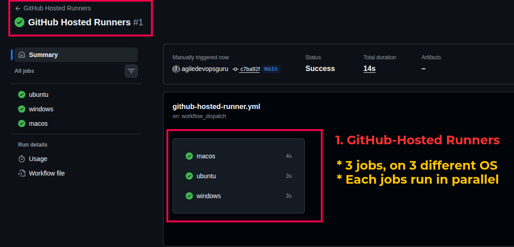
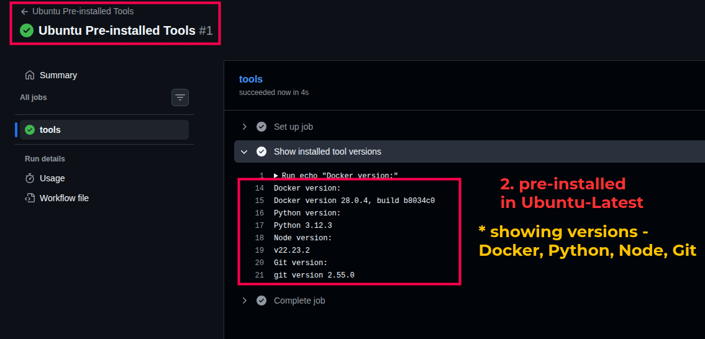
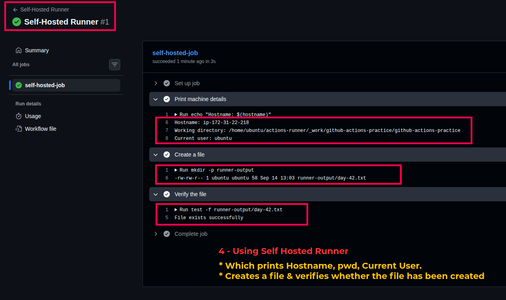
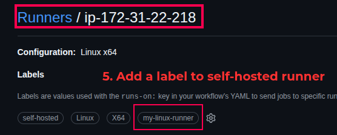

# Day 42 – Runners: GitHub-Hosted & Self-Hosted

---

## Challenge Tasks

### Task 1: GitHub-Hosted Runners

1. Create a workflow with 3 jobs, each on a different OS:
   - `ubuntu-latest`
   - `windows-latest`
   - `macos-latest`
2. In each job, print:
   - The OS name
   - The runner's hostname
   - The current user running the job
3. Watch all 3 run in parallel.

**Workflow:** `.github/workflows/github-runner.yml`

```yaml
name: GitHub Hosted Runners

on:
  workflow_dispatch:

jobs:
  ubuntu:
    runs-on: ubuntu-latest
    steps:
      - name: Print Ubuntu details
        run: |
          echo "OS: Ubuntu"
          echo "Hostname: $(hostname)"
          echo "User: $(whoami)"

  windows:
    runs-on: windows-latest
    steps:
      - name: Print Windows details
        shell: pwsh
        run: |
          Write-Host "OS: Windows"
          Write-Host "Hostname: $env:COMPUTERNAME"
          Write-Host "User: $env:USERNAME"

  macos:
    runs-on: macos-latest
    steps:
      - name: Print macOS details
        run: |
          echo "OS: macOS"
          echo "Hostname: $(hostname)"
          echo "User: $(whoami)"
```

**What is a GitHub-hosted runner? Who manages it?**

- A GitHub-hosted runner is a temporary machine/virtual environment provided by GitHub to execute GitHub Actions jobs.
- GitHub manages the runner infrastructure, operating system image, maintenance, and cleanup.
- GitHub-hosted runners are useful because no server setup is required from the developer.

**Screenshot:** Add your screenshots here.



---

### Task 2: Explore What's Pre-installed

1. On the `ubuntu-latest` runner, print:
   - Docker version
   - Python version
   - Node version
   - Git version
2. Check GitHub's official documentation for the complete pre-installed software list.

**Workflow:** `.github/workflows/ubuntu-preinstall.yml`

```yaml
name: Ubuntu Pre-installed Tools

on:
  workflow_dispatch:

jobs:
  tools:
    runs-on: ubuntu-latest
    steps:
      - name: Show installed tool versions
        run: |
          echo "Docker version:"
          docker --version

          echo "Python version:"
          python3 --version

          echo "Node version:"
          node --version

          echo "Git version:"
          git --version
```

**Why does it matter that runners come with tools pre-installed?**

- Pre-installed tools make workflows faster to configure and execute.
- Common tools such as Git, Python, Node.js, and Docker can be used without installing them manually.
- It reduces setup time and makes CI/CD workflows easier to maintain.
- The exact software versions can change when GitHub updates the runner image, so production workflows should pin versions when necessary.

**Official documentation:**  
[GitHub Actions runner images](https://github.com/actions/runner-images)

**Screenshot:**



---

### Task 3: Set Up a Self-Hosted Runner

1. Open your GitHub repository.
2. Go to **Settings → Actions → Runners**.
3. Click **New self-hosted runner**.
4. Select **Linux** and the correct architecture.
5. Run the commands shown by GitHub on your Linux machine or cloud VM.

A typical setup looks like this:

```bash
mkdir actions-runner
cd actions-runner

# Download the runner package using the exact command
# generated by GitHub for your repository.

# Extract the downloaded archive using the command
# generated by GitHub.

# Configure the runner using the exact token command
# generated by GitHub.
./config.sh --url https://github.com/YOUR_USERNAME/YOUR_REPOSITORY --token YOUR_TOKEN

# Start the runner
./run.sh
```

> **Important:** Do not reuse the example token above. GitHub generates a temporary registration token in the runner setup page.

To run the runner as a persistent service:

```bash
sudo ./svc.sh install
sudo ./svc.sh start
sudo ./svc.sh status
```

**Verification**

- The runner should appear in **Settings → Actions → Runners**.
- A green dot and **Idle** status mean that the runner is online and waiting for a job.

**Screenshot:**


---

### Task 4: Use Your Self-Hosted Runner

Create:

`.github/workflows/self-hosted.yml`

```yaml
name: Self-Hosted Runner

on:
  workflow_dispatch:

jobs:
  self-hosted-job:
    runs-on: self-hosted

    steps:
      - name: Print machine details
        run: |
          echo "Hostname: $(hostname)"
          echo "Working directory: $(pwd)"
          echo "Current user: $(whoami)"

      - name: Create a file
        run: |
          mkdir -p runner-output
          echo "Created by GitHub Actions on $(date)" > runner-output/day-42.txt
          ls -l runner-output/day-42.txt

      - name: Verify the file
        run: |
          test -f runner-output/day-42.txt
          echo "File exists successfully"
```

**Verification**

After the workflow completes, check the runner machine:

```bash
ls -l runner-output/day-42.txt
cat runner-output/day-42.txt
```

Expected result:

```text
File exists successfully
```

> The file is created in the runner's workspace. GitHub Actions may clean or reuse workspace files between jobs, so for a permanent file, use a dedicated absolute directory outside the workspace and ensure the runner user has permission to write there.

**Screenshot:**



---

### Task 5: Labels

1. Add a custom label to the self-hosted runner, for example:
   - `my-linux-runner`
2. Update the workflow to use the label.

**Workflow:** `.github/workflows/self-hosted-label.yml`

```yaml
name: Self-Hosted Runner With Label

on:
  workflow_dispatch:

jobs:
  labeled-job:
    runs-on: [self-hosted, my-linux-runner]

    steps:
      - name: Verify labeled runner
        run: |
          echo "Hostname: $(hostname)"
          echo "Runner selected successfully"
```

**Why are labels useful when you have multiple self-hosted runners?**

- Labels allow GitHub Actions to select a runner with the required capabilities.
- You can label runners by operating system, architecture, hardware, environment, or installed software.
- For example, a job can target a Linux runner with Docker or a runner connected to a private network.
- A job using multiple labels runs only on a runner that matches all the labels.

**Screenshot:**




---

### Task 6: GitHub-Hosted vs Self-Hosted

| | GitHub-Hosted | Self-Hosted |
|---|---|---|
| Who manages it? | GitHub manages the runner infrastructure and images | You or your organization manages the machine |
| Cost | Public repositories generally have included usage; private repository costs depend on plan and usage | You pay for the server, VM, electricity, maintenance, and other infrastructure costs |
| Pre-installed tools | Many common tools are pre-installed | You install and maintain the tools yourself |
| Good for | Quick setup, standard CI/CD, builds, and tests | Custom environments, private networks, special hardware, and long-running workloads |
| Security concern | Jobs run on GitHub-managed infrastructure; secrets and code still need protection | You must secure, patch, monitor, and isolate the runner yourself |

---

## Important Notes

### GitHub-hosted runner

A GitHub-hosted runner is a machine managed by GitHub that executes workflow jobs. It is convenient because the machine is provisioned and maintained for you.

### Self-hosted runner

A self-hosted runner is a machine that you register with GitHub Actions. It can be your local Linux machine, EC2 instance, Utho VM, or another server.

### Runner labels

Labels help GitHub choose the correct self-hosted runner. The default labels commonly include values such as `self-hosted`, the operating system, and the architecture. Custom labels can be added for special requirements.

### Security best practices

- Do not use self-hosted runners for untrusted pull requests without understanding the risk.
- Never print secrets in workflow logs.
- Keep the runner operating system and installed software updated.
- Use least-privilege permissions.
- Prefer isolated or ephemeral runners for sensitive workloads.
- Do not run the runner with unnecessary administrator/root privileges.

---

## Screenshots

Replace the image paths below with your actual screenshots:

- `images/task1.png`
- `images/ubuntu.png`
- `images/windows.png`
- `images/macos.png`
- `images/task2.png`
- `images/selfhosted.png`
- `images/task4.png`
- `images/label.png`
- `images/task5.png`

---

## Conclusion

In Day 42, I learned that every GitHub Actions job needs a runner. GitHub-hosted runners are managed by GitHub and are easy to use, while self-hosted runners are managed by the user or organization and provide more control over hardware, software, networking, and security.

I also learned how to register a self-hosted runner, execute jobs on my own machine, create and verify files, and use labels to target a specific runner.
