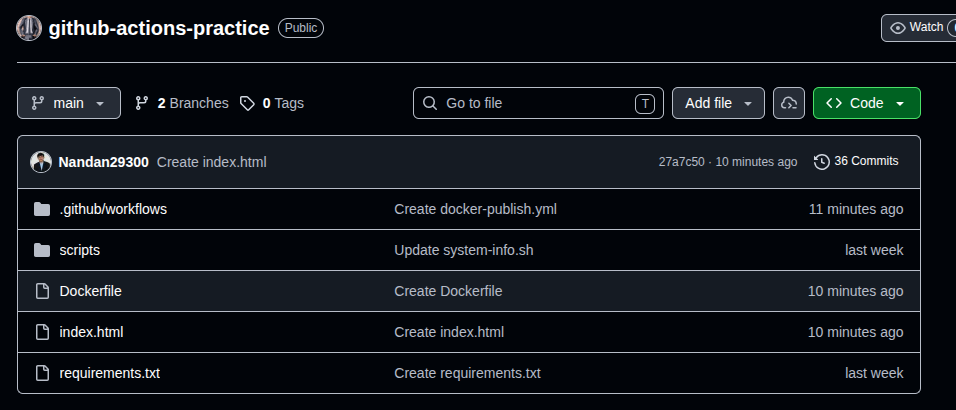
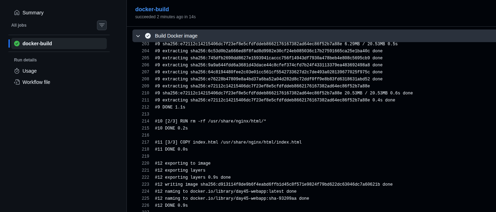
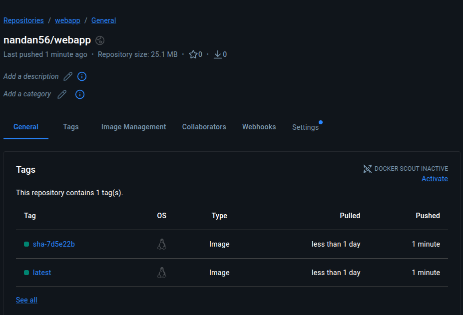
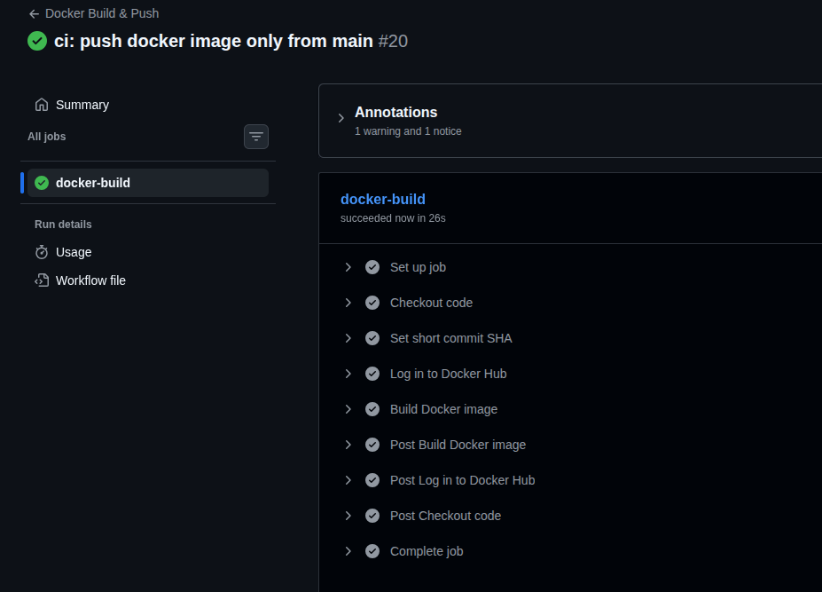
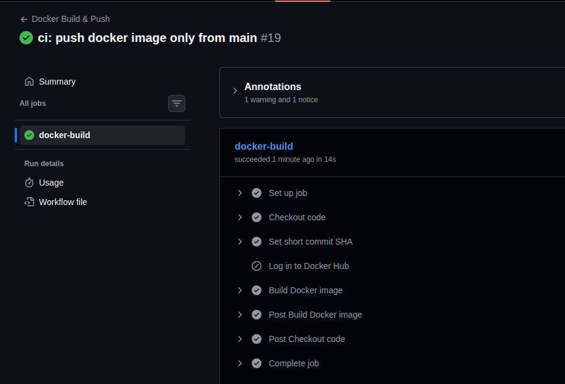
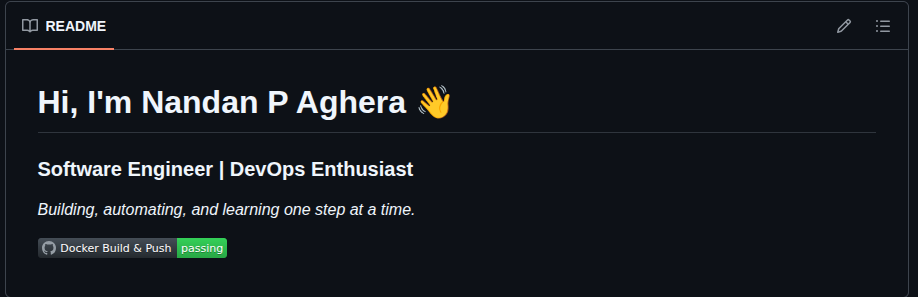
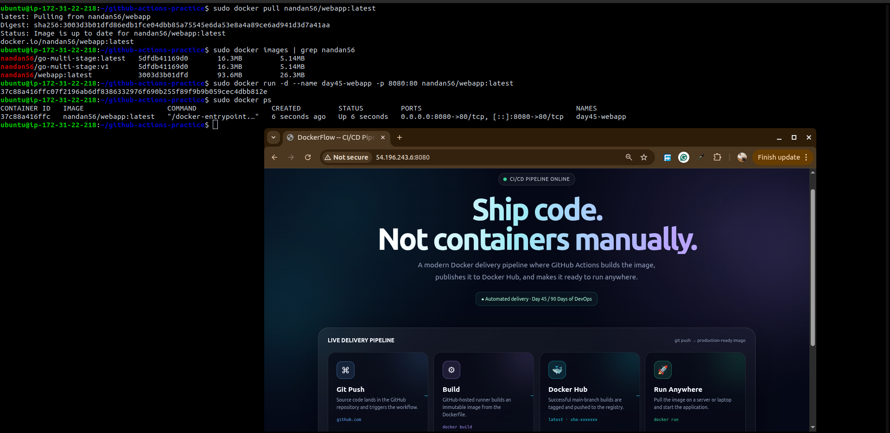

# Day 45 -- Docker Build & Push in GitHub Actions

## Challenge Tasks

### Task 1: Prepare

Created a modern static web application for the Docker CI/CD
demonstration.

-   `index.html` contains the animated CI/CD dashboard.
-   `Dockerfile` packages the application with Nginx.
-   The application was manually built and tested on an AWS EC2
    instance.
-   GitHub repository secrets were configured:
    -   `DOCKER_USERNAME`
    -   `DOCKER_TOKEN`



------------------------------------------------------------------------

### Task 2: Build the Docker Image in CI

Created `.github/workflows/docker-publish.yml`.

The workflow:

1.  Triggers on a push to `main`.
2.  Checks out the repository using `actions/checkout@v4`.
3.  Generates a short commit SHA.
4.  Builds the Docker image using `docker/build-push-action@v6`.
5.  Tags the image with `latest` and a short SHA.

For Task 2, the image was built with `push: false`, so it was not
uploaded to Docker Hub.

**Verify:** The Docker image built successfully in GitHub Actions.



------------------------------------------------------------------------

### Task 3: Push to Docker Hub

On a push to `main`, the workflow:

1.  Logs in to Docker Hub using GitHub Secrets.
2.  Builds the Docker image.
3.  Tags the image as:
    -   `nandan56/webapp:latest`
    -   `nandan56/webapp:sha-<short-commit>`
4.  Pushes both tags to Docker Hub.

**Verify:** Both tags were visible in Docker Hub.



------------------------------------------------------------------------

### Task 4: Only Push on Main

The workflow was updated so that Docker Hub publishing happens only for
a push to `main`.

-   **Feature branch / Pull Request:** Docker image is built, but Docker
    Hub login and publishing are skipped.
-   **Push to `main`:** Docker image is built and pushed to Docker Hub.

The workflow uses:

``` yaml
if: github.event_name == 'push' && github.ref_name == 'main'
```

and:

``` yaml
push: ${{ github.event_name == 'push' && github.ref_name == 'main' }}
```

**Feature branch verification:** The GitHub Actions run showed Docker
Hub login was skipped while the Docker image build succeeded.

**Main branch verification:** The image was successfully pushed to
Docker Hub with both `latest` and SHA-based tags.





------------------------------------------------------------------------

### Task 5: Add a Status Badge

Added the GitHub Actions workflow status badge to the repository
`README.md`.

``` markdown
[](https://github.com/agiledevopsguru/github-actions-practice/actions/workflows/docker-publish.yml)
```

The badge is generated and updated automatically by GitHub Actions. A
green `passing` status indicates that the latest workflow run succeeded.



------------------------------------------------------------------------

### Task 6: Pull and Run It

After the image was published to Docker Hub, it was pulled and run on
the AWS EC2 server.

``` bash
sudo docker pull nandan56/webapp:latest
sudo docker run -d --name day45-webapp -p 8080:80 nandan56/webapp:latest
```

The running container was verified with:

``` bash
sudo docker ps
```

The application was then accessed through the EC2 public IP on port
`8080`:

``` text
http://<EC2-PUBLIC-IP>:8080
```

The web application loaded successfully in the browser.



------------------------------------------------------------------------

## Docker Hub

Docker Hub repository:

[Docker Hub --
nandan56/webapp](https://hub.docker.com/r/nandan56/webapp)

The repository contains both:

-   `latest`
-   `sha-<short-commit>`

------------------------------------------------------------------------

## Full Journey: `git push` to a Running Container

1.  **Git push** -- Code changes are pushed to the GitHub repository.
2.  **GitHub Actions triggers** -- The workflow runs for pushes to
    `main`, pushes to `feature/**` branches, and pull requests targeting
    `main`.
3.  **Checkout** -- `actions/checkout@v4` downloads the repository into
    the GitHub Actions runner.
4.  **Set commit SHA** -- The workflow extracts the first 7 characters
    of the commit SHA for version-specific image tagging.
5.  **Build** -- Docker builds the image from the `Dockerfile`.
6.  **Branch decision**:
    -   `main` push → Docker Hub login and image publishing are
        performed.
    -   Feature branch / pull request → the image is built for
        validation, but it is not pushed to Docker Hub.
7.  **Tag** -- For a `main` push, the image receives:
    -   `nandan56/webapp:latest`
    -   `nandan56/webapp:sha-<first 7 characters of commit SHA>`
8.  **Push** -- Both tags are uploaded to Docker Hub for a `main` push.
9.  **Pull** -- The EC2 server pulls the published image from Docker
    Hub.
10. **Run** -- Docker starts the Nginx container and maps host port
    `8080` to container port `80`.
11. **Serve** -- Nginx serves the animated `index.html` application.
12. **Access** -- The application becomes available through the EC2
    public IP on port `8080`.

------------------------------------------------------------------------

## What I Learned

-   How Docker images can be built automatically in GitHub Actions.
-   How Docker Hub authentication works with GitHub Secrets.
-   How to use immutable SHA-based image tags alongside `latest`.
-   How to separate build validation from Docker Hub publishing.
-   How GitHub Actions can build and publish container images
    automatically.
-   How a CI/CD pipeline connects source control, image builds, a
    container registry, and a running container on EC2.
-   How to pull a published Docker image and run it on a cloud server.
